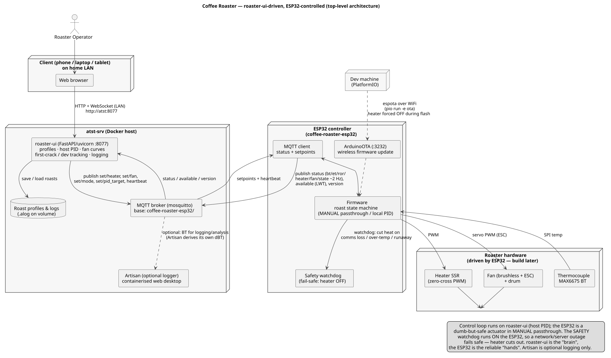

# coffee-roaster

ESP32-controlled coffee roaster. A web UI (**roaster-ui**, a FastAPI app on the
home server) is the "brain" — roast profiles, PID targets, fan curves, logging,
first-crack/dev tracking — and the ESP32 is the "hands": it drives the hardware
and enforces its own local safety. They talk over **MQTT**.

The ESP32 runs as a dumb-but-safe actuator: roaster-ui computes the PID on the
host and pushes heater%/fan setpoints, so the ESP normally sits in MANUAL
passthrough. The ESP has an on-board PID mode too (fail-safe fallback), but the
current setup keeps the loop on the host. Either way the **safety watchdog runs
on the ESP**, so a network/server outage fails safe — heater cuts out.

> Artisan is no longer the controller. It can still be attached as an optional
> logger/analysis client (feed it BT and let it derive its own ΔBT), but it no
> longer drives the roast, and the old Modbus-TCP path has been removed.



Top-level architecture. Source: [`docs/arch.puml`](docs/arch.puml) — regenerate
the SVG with `plantuml docs/arch.puml`.

```
┌─ client browser (LAN) ─┐        ┌─ atst-srv (Docker host) ──┐   MQTT   ┌─ ESP32 (coffee-roaster-esp32) ─┐
│  http://atst:8077      │──────▶ │  roaster-ui (FastAPI)     │◀───────▶ │  MQTT client + PID/safety      │──▶ roaster HW
│  (roaster-ui web UI)   │   WS   │  profiles · PID · logging │  broker  │  ArduinoOTA (:3232)            │
└────────────────────────┘        └───────────────────────────┘         └────────────────────────────────┘
```

## Layout

| Path | What |
|------|------|
| `docs/arch.puml` / `docs/arch.svg` | Architecture diagram (PlantUML source + rendered SVG). |
| `docs/mqtt-topics.md` | The MQTT topic + payload contract between roaster-ui and the ESP32. |
| `esp32/` | Firmware for the controller (PlatformIO / Arduino). All HW pins are **placeholders** in `esp32/include/config.h`. |
| `esp32/reference/roaster.yaml` | Original ESPHome config that first got the board on WiFi/MQTT. Kept for reference; the control firmware supersedes it. |
| `tools/fake_esp.py` | A fake ESP that speaks the MQTT protocol, for driving roaster-ui without hardware. |

> The roaster-ui app itself lives on the server under `~/docker/roaster-ui/`
> (FastAPI + uvicorn on :8077, MQTT client, uPlot chart UI), not in this repo.

## Control / transport

- **Transport:** MQTT under base `coffee-roaster-esp32/` (broker on atst; see the
  broker ACL that scopes the `roaster` user to that tree).
- **Firmware publishes:** `<base>/status` (JSON: bt, et, ror, heater, fan, state
  ~2 Hz), `<base>/available` (retained LWT), `<base>/version` (retained fw stamp).
- **Firmware subscribes:** `<base>/set/{heater,fan,mode,pid_target}` and
  `<base>/heartbeat` (comms watchdog — heat is cut if the controller goes silent).
- Full contract: [`docs/mqtt-topics.md`](docs/mqtt-topics.md).

## Status

- [x] ESP32 online on WiFi/MQTT
- [x] MQTT control firmware (PID + roast state machine + safety watchdog)
- [x] roaster-ui web app driving profiles / PID / logging (`~/docker/roaster-ui/`)
- [x] Firmware version reporting (retained `<base>/version`, shown in roaster-ui)
- [ ] Hardware build + wiring (**HW pins are placeholders** in `config.h`)

### Fan wiring note

The blower is a **brushless motor on an RC ESC** (the round "H SKY" board potted
in the hub), originally driven by the "SKY V3" dialer pot. The ESP32 replaces the
dialer: wire `PIN_FAN_PWM` → the ESC's **S** pad and tie **grounds together**. The
firmware emits a 50 Hz servo pulse (1000–2000 µs) and arms the ESC at boot by
holding min throttle. Timing lives in `esp32/include/config.h` (`FAN_*`).

## Secrets

Nothing secret is committed. Copy the examples and fill them in locally:

```bash
cp esp32/include/secrets.h.example esp32/include/secrets.h   # WiFi/MQTT/OTA creds for firmware
```

Real secret files (`secrets.h`, `.env`, keys) are `.gitignore`d. The MQTT
credentials for tooling come from the environment (`MQTT_USER` / `MQTT_PASS`),
never hard-coded — see `tools/fake_esp.py`.
